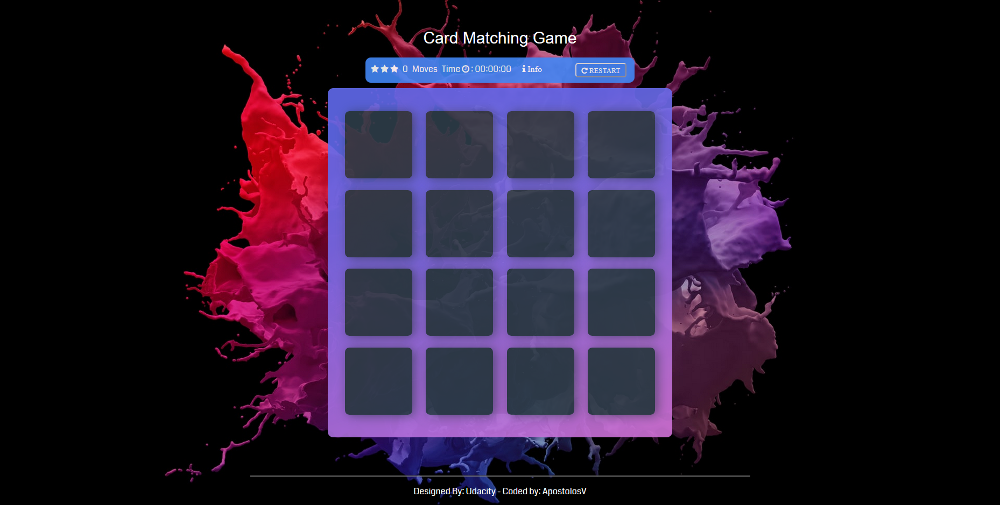

# Card Matching Game

## Game's Interface.  

### Background Photo
You can see Background Photo [here](https://unsplash.com/photos/mxIGWk111u0)
Peter Olexa
### Who's idea is?
It is designed by [Udacity](https://www.udacity.com/), coded by me !!
### What is this game?
It is a memory card game of matching two equal cards, until all 8 pairs(16 cards) are shown.

### Score
Every 8 moves(2 cards clicked = 1 move), you lose 1 star. More stars = Better score. 

When you reach 0 stars, you lose :pensive:

  |Stars| Moves |
  |:--:|:--:|
  |3|0-7|
  |2| 8-15 |
  |1| 16-24| 
  |0|25|
  
### Timer
In the center you will see a timer. It shows how much time you play the round.

### Info
Here, Timer stops and you can see Grading system.

### Restart
When you press it, stars become 3, timer goes 00:00:00, cards are closed and in different places and cards are shown for 3 seconds.

### Win
If you win, it shows you a win-screen.
 
 Win-screen shows:
  - Congratulations
  - With how many stars you won
  - Time elapsed
  - If you want to play again
  - A play again button

### Things TODO:

  - [x] Add lose case and screen
  - [x] Stars, time elapsed in lose screen
  - [x] Better designed win screen and game's interface
  - [ ] Music
  - [ ] Better Responsiveness
  - [ ] Better Info's screen
